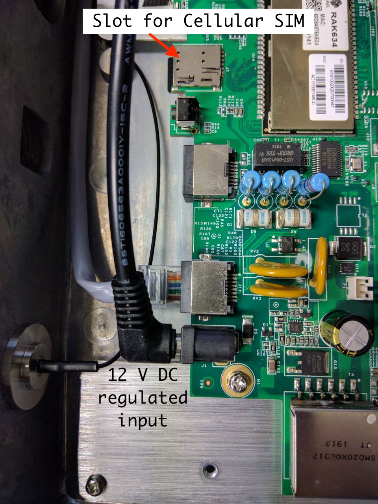
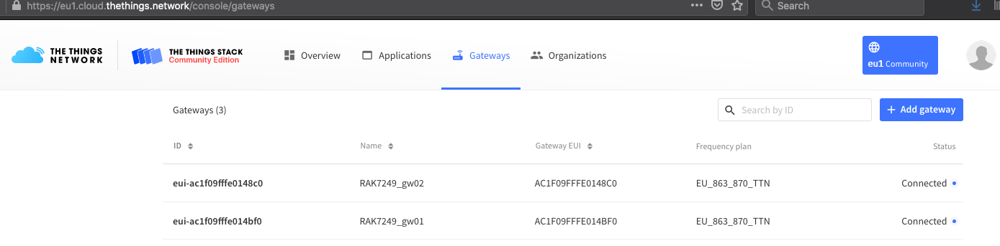
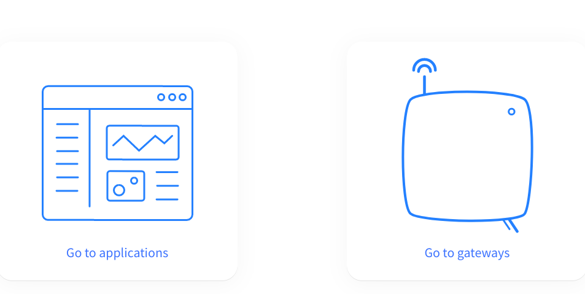
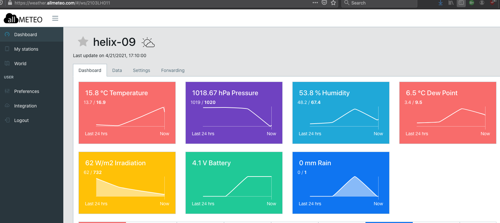
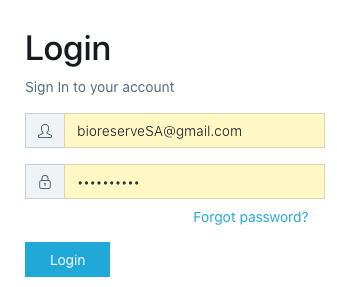
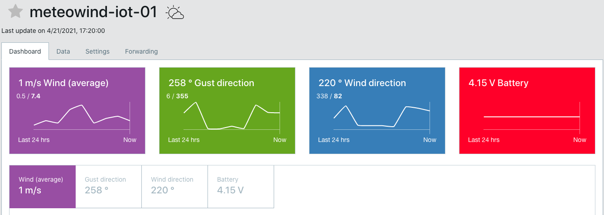
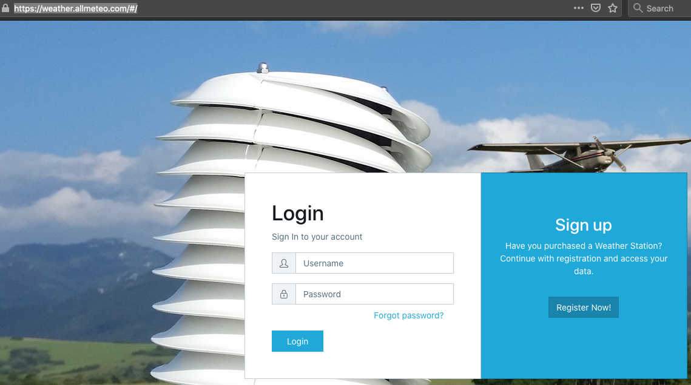

## Cellular SIM

If the gateway will be connected to the Internet by a cellular service
provider, you will need to buy a micro SIM card (dimensions 9 mm X 12
mm) in your country and pay the usage fee according to your provider
conditions. A full size SIM has normally pre-cuts to accommodate the
micro SIM format.

You will need to disable the requirement for inserting a PIN (Personal
Identification Number) in this application. You can ask the vendor of
the SIM to perform this procedure, or you can install the SIM in a
phone, find the menu for disabling the PIN, remove the SIM and try again
in the phone to make sure that it will not ask for a PIN.

Make sure that the power to the gateway has been disconnected.

Remove the lid of the RAK gateway by unscrewing the 12 small bolts with
phillip (star) heads. This will expose the motherboard .The slot to
insert the SIM is located just above the one that houses the Micro SD
memory card.

Insert the SIM card with the exposed terminals facing downwards. You can
then put back the lid and tighten the 12 bolts.

Perform a preliminary test of the gateway in a place with good cellular
coverage before the installation in the tower.

Remember to have all the antennas connected to the gateway before
powering it on.

Apply power either with the 12 V cable as shown in the picture or by the
external POE, in which case you will not need the black cable shown.

Verify the connectivity by pointing an internet browser to
[https://eu1.cloud.thethings.network/console/](https://eu1.cloud.thethings.network/console/)

Enter your user name and password, you will see:

Click on GATEWAYS and you will be presented with a list of gateways and
their connection status. Your gateway should show as connected with a
blue dot:

It might take a while for the TTN server to respond, if after a few
minutes your gateway does not show connected verify the functionality of
the SIM.

Do not proceed any further until your gateway shows as connected.

Now you can test that each of your LoRaWAN meteo sensors can connect to
the gateway. Start with the meteohelix, make sure that it is turned on
(it has an internal switch that must be turned on with and not too far
from the gateway (this is just for the test).

Point an internet browser to
[https://weather.allmeteo.com/\#/](https://weather.allmeteo.com/#/)

You will see:

Register with the user name and password that were sent to you and then
login with these credentials.

You should see a screen like the following:

Now you can turn on the meteo wind sensor and by clicking on My stations
you will see that the meteowind will have a green tag with ONLINE
written on it. Clicking on meteowind will show:

**Congratulations!** you are now ready to proceed to the RAK hardware
installation in the tower and then that of the meteo sensors, in the
places you have chosen.
