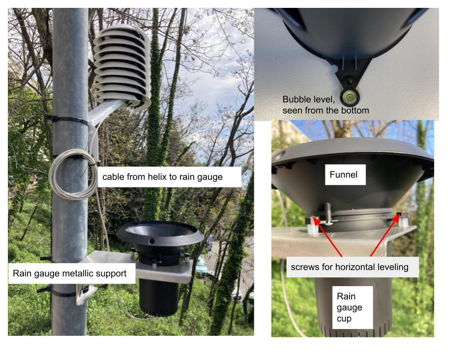
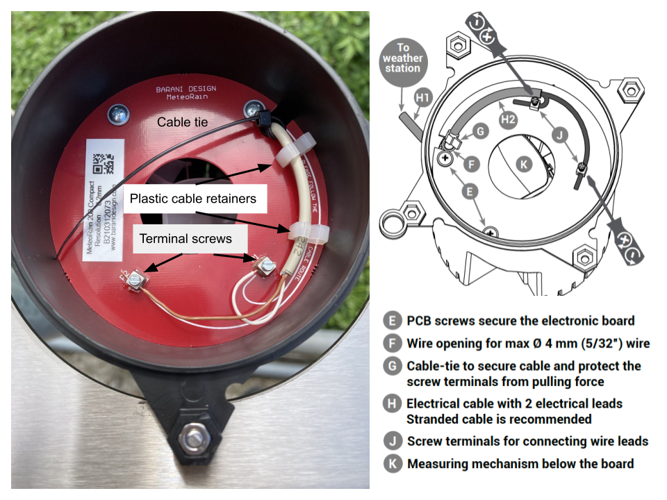
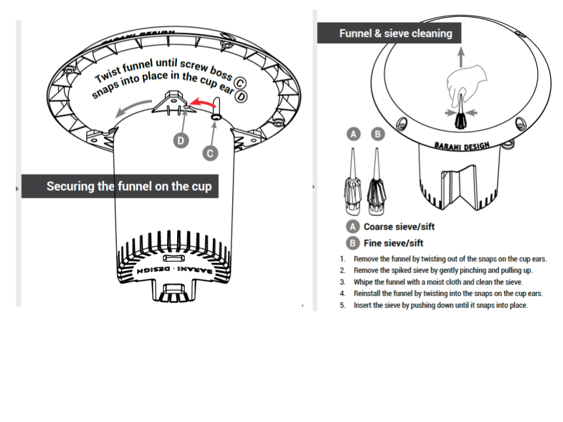
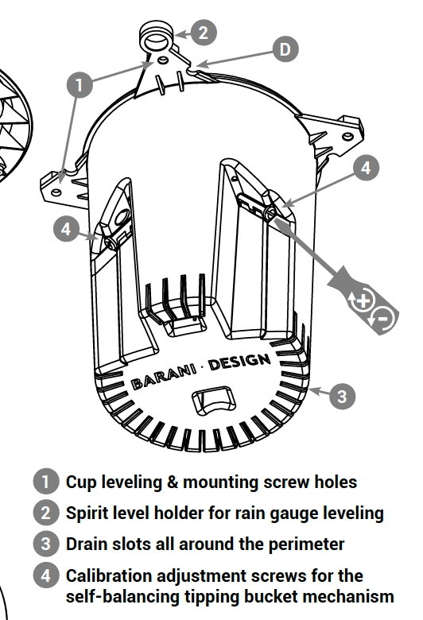

## Barani MeteoRain 200 Compact

The pluviometer (rain gauge) should be installed vertically about one
meter above the ground, to minimize the effect of the wind. The support
provided can be used to attach to a pole, at least 35 mm in diameter by
means of U bolts or hose clamps. It can also be fixed to a flat
structure using 4 screws.

The top should be horizontal. A bubble level indicator in the device
helps in checking the horizontality, which can also be adjusted by means
of the three screws that attach the plastic cup of the rain gauge to the
metallic support.

The Barani Helix meteorological station has a 4 meters long cable to
convey the rain sensor data, so it can be installed at some distance.

Visit
[https://www.baranidesign.com/meteorain-200-compact](https://www.baranidesign.com/meteorain-200-compact)
for details.

The following picture is an example of pole installation:

Insert the cable from the meteo station through the hole at the bottom
of the rain gauge. Put a cable tie around it to prevent accidental pull
off. Remove about 4 cm off the cable insulation to expose the two wires
inside and route the cable through the two white plastic retainers as
shown in the picture. Remove about 1 cm insulation from the two wire
ends. Loosen the terminal screws and insert the two wire ends (the two
wires are interchangeable, they connect to a normally open reed switch,
when the tipping bucket tips, the reed switch changes state).

Tighten the terminal screws. If the rain gauge is installed on a tall
pole or where vibrations

are expected, drip a drop of superglue on each wire terminal to prevent
the wire connection screws from loosening over time.

Loosen the two screws at the bottom of the funnel so that it can be
inserted in the rain gauge cup by horizontally twisting it until it
snaps in place.

Insert either the coarse or the fine sieve in the hole at the center of
the funnel. This can be removed to facilitate cleaning.

The resolution of the rain gauge is 0.2 mm.

**Calibration Procedure**

1.  Make sure that the rain gage is level. Check with the fitted bubble level and adjust if required by turning the three leveling screws.

2.  Obtain a 5 ml (5 cubic centimeter) syringe to precisely measure 4 ml of water, with a resolution of a single drop.

3.  Remove the funnel so you can see the tipping of the bucket. You will also hear the noise produced by the tipping, you should keep track of the number of tips for a quick check.

4.  Gently pour water from the syringe into the white plastic bucket at the centre of the rain gauge. The last ml should be poured one drop at a time, until the bucket falls and exposes the other one.

5.  Adjust the calibration screws with a screwdriver so that each bucket tips when filled with exactly 4 ml of water. Turning the screw clockwise increases the amount of water required for tipping.

6.  Repeat the procedure until both buckets tip with exactly 4 ml of water.

