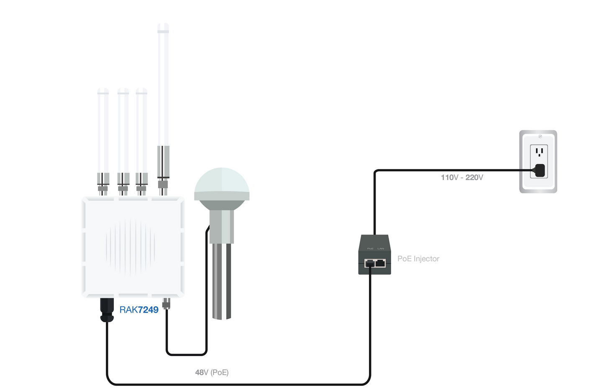
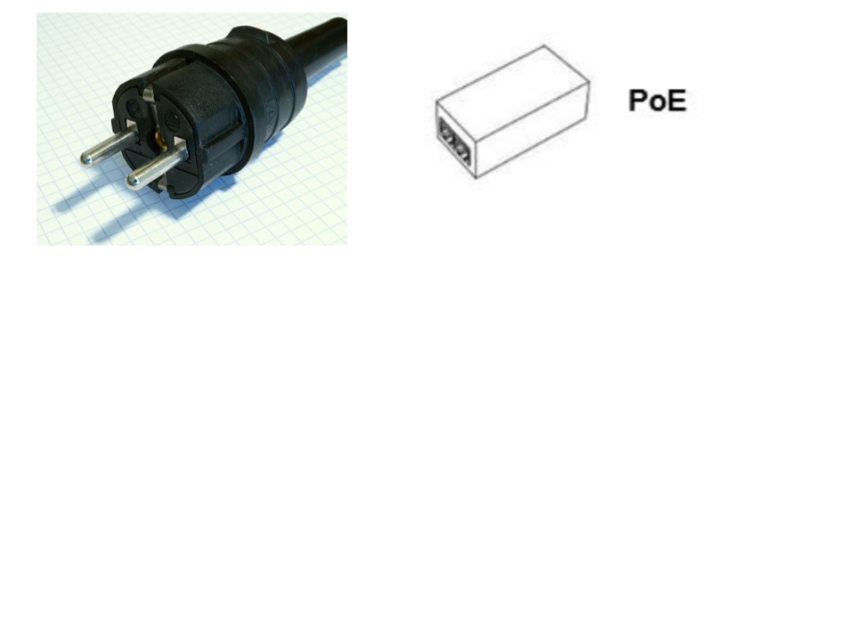
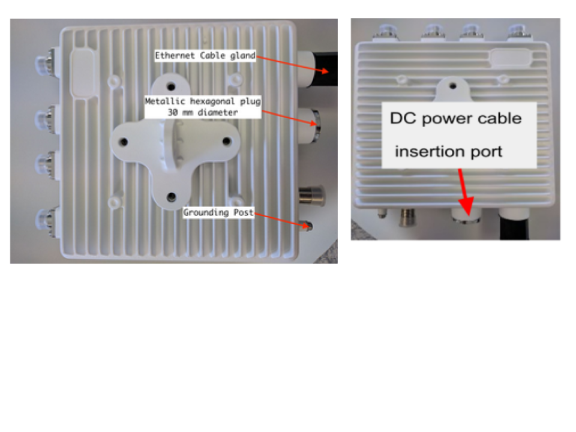
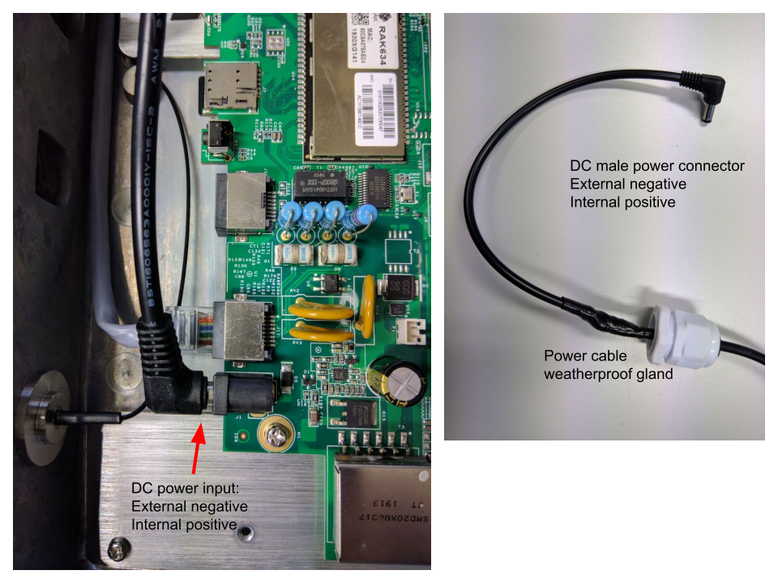

## RAK Gateway Electrical installation

The RAK gateway is normally connected using POE (Power over Ethernet),
consisting of a transformer from the grid alternating voltage (from 120
to 240 V) to 48 V DC (Direct Current). Inside the gateway the incoming
DC voltage is converted to regulated 12 V.

Transmitting radios should **never** be operated without a proper
antenna. So the very first step is to connect each of the supplied
antennas to the type N connectors, matching the labels in the gateway
with those of the antennas; the longest antenna corresponds to the LoRa
radio, the short ones are for 2 for cellular and one for WiFi. Even if
you do not use the WiFi connection you must attach the corresponding
antenna. The GPS antenna is connected at the bottom of the gateway but
should be installed pointing up.

Connecting to the electrical grid:

Connect the POE to the grid power outlet using an adapter from the
Schuko plug (shown in the picture) to the type of plug used in your
country. If adapters are not available, have an electrician replace the
plug with the proper one.

The POE is NOT waterproof, so it must be protected from the weather. It
has two Ethernet connectors. The one labeled LAN should be connected to
the Ethernet switch if there is one available. If Internet connectivity
is obtained by WiFi or Cellular, leave this port empty, but make sure
that it is protected from the weather.

Insert the plug of an outdoor proof Ethernet cable into the connector
labeled POE. This will carry the 48 V to the Ethernet connector of the
gateway

CAUTION: Never connect this port to a laptop, since the 48 will damage
it.

Inside the gateway, the 48 V DC will be applied to a voltage regulator
that will provide the proper voltage for the operation of the internal
devices.

**Remember** to disconnect the power before removing the lid to insert
the SIM card.

**Low voltage DC Powering**

Alternatively to the PoE, the gateway can be powered by a 12 V DC
regulated supply using a connector with an outer diameter of 5.5 mm. The
positive terminal is inside.

This method is to be used when feeding the gateway through a
photovoltaic system.

The lid of the box should be opened by removing the 12 small bolts with
phillips heads.

It is also necessary to remove the metallic hexagonal plug (you will
need a 30 mm wrench, or a crescent wrench).

Insert the power cable into the weatherproof gland and through the DC
port opening to reach the DC input of the board, next to the Ethernet
connector as shown in the picture:

After removing the plug, the hole must be fitted with a cable gland to
seal the enclosure from humidity and insects. The DC cable will go
through the cable gland inside the enclosure, the gland then must be
tightened against the body of the enclosure.

Screw the plastic weatherproof gland into the DC power board in the
place previously occupied by the 30 mm hexagonal nut, to seal the
gateway enclosure.

Before closing the lid, make sure that the LEDs turn on when applying
power. Remember to have all the antennas connected when doing this test
to prevent damage to the radios.

Close the lid and screw back the 12 small bolts.

**Installation tips**

Make sure that the device enclosure and the antenna connector are
weatherproof.

Use weatherproofing tape (not electrical tape or duct tape).

No cable should be left dangling unsupported. All cables should be tied
or taped down to prevent "wiggling" in the wind.

Use black nylon zip ties (white ties break down in UV) to secure the
cable to the supporting structure. Whenever possible, use conduit and
weatherproof cables, especially the Ethernet cable. Normal indoor
Ethernet cable will not last if exposed to sunlight.

**Choice of the gateway installation site**:

1.  It is strongly recommended to have an unobstructed view from the gateway site to the place where the LoRa Barani Meteo station (or the LoRa wind sensor) is installed. This is referred to specifying that there should be line of sight (**LOS**) between the radio transmitter and the receiver.

2.  Beware of trees whose growth might obstruct the path.

3.  On rooftops, mounting the gateway close to the outer edge helps to avoid problems with reflections.

4.  A suitable vertical metallic pipe (mast) is used to support the gateway by means of the supplied brackets. The mast should be attached to an existing building by a sturdy support structure or sunk into the ground and embedded in concrete.

5.  The place must be secure to minimize the possibility of theft of the equipment.

6.  There should be some kind of Internet connectivity: a port in an Ethernet switch, a WiFi access point or good Cellular coverage. The bandwidth consumed is very limited, but the connection should be reliable.

7.  There should be electrical power available; the gateway consumption is around 6 watts, about the same as an LED light bulb, so quite manageable. If electricity is not available, a photovoltaic system must be installed to meet this need.

8.  Lightning protection and grounding to safeguard the gateway should be provided

