## RAK Gateway hardware assembly

The Rak LoRaWAN gateway must be installed vertically, with the antenna
connectors (LoRa, WiFi, LTE-DIV/LoRa2 LTE-MAIN) facing up and the GPS
antenna connector facing down, on the same side as the Ethernet (PoE)
gland.

The mechanical assembly has to be done carefully. The cross shaped piece
that connects to the back of the weatherproof box will fit only in one
way, which is with the striated circular shape facing down. It is the
only way that the 4 holes will match the ones in the housing:

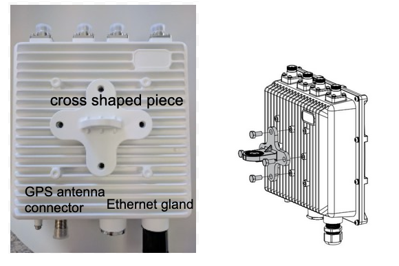

The remaining supporting pieces should be attached to the cross shaped
support using the supplied stainless steel bolts, washers and nuts.

The bolt head fits precisely in recessions in the metal supports. The
flat washer should go first, then the slotted (pressure) washer, and
then the nut. Use a 10 mm wrench to tighten the nut. The 2 long bolts are
used to join the 2 brackets surrounding the mast as shown in the photos.

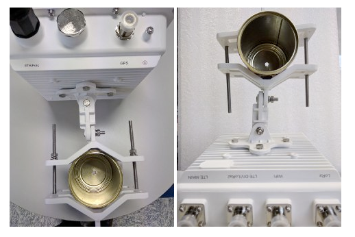

A sturdy vertical mast is the preferred structure to hold the gateway.
Its diameter should be greater than 42 mm (1 ⅝ inches) and up to 112 mm
(4 1/2 inches). The mast should be robust and well anchored in the
terrain or attached to a suitable structure to be able to withstand the
winds expected in the installation zone. The height of the mast should
allow for the antennas to have an unobstructed view of the LoRaWAN Meteo
station.

When installing in a tower, try to have the antennas facing the
direction where the LoRaWAN Meteo station will be placed.

Use a suitable stand-off to separate the gateway from the tower
structural elements.

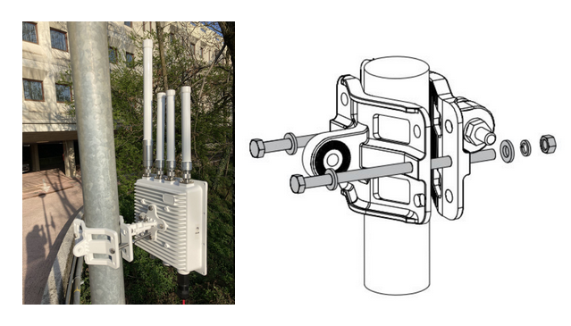

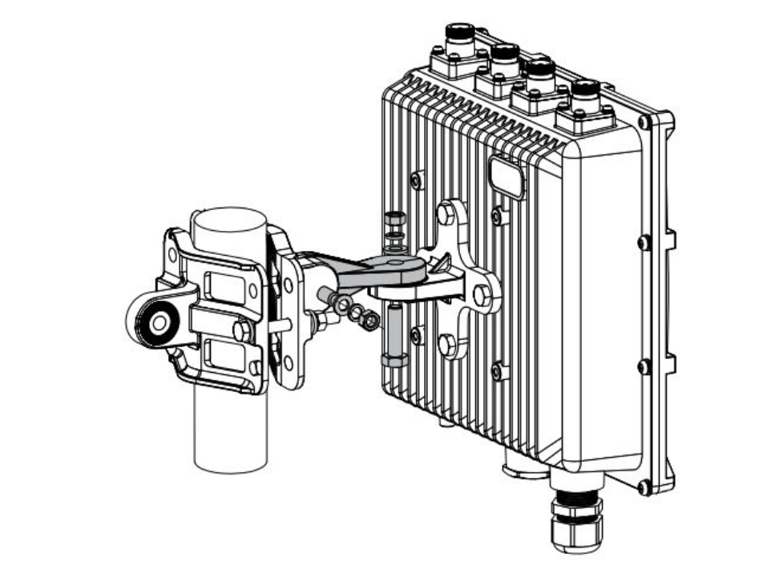

A horizontal pipe within the above dimensions can also be used to
install the gateway, if it is sturdy enough. In this case the brackets
will be attached directly to the cross shaped piece.

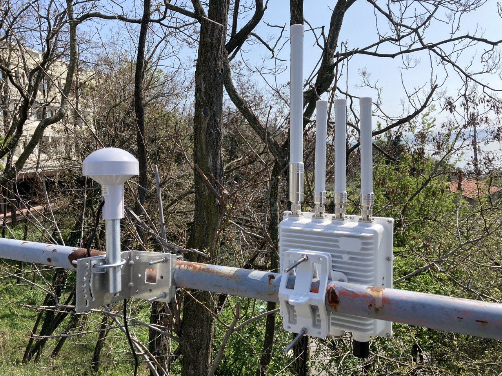

Connect the 4 supplied cylindrical antennas to the type N connectors on
the top of the box. The longest antenna has to be connected to the
connector labeled LoRa, the short one labeled WiFi to the WiFi connector
and the other two are interchangeable and should be connected to the
connectors labeled LTE. Only one LTE radio is used in this
configuration, so the second antenna is not connected.

The GPS antenna screwed to the short metal pipe should always be
attached facing upwards.

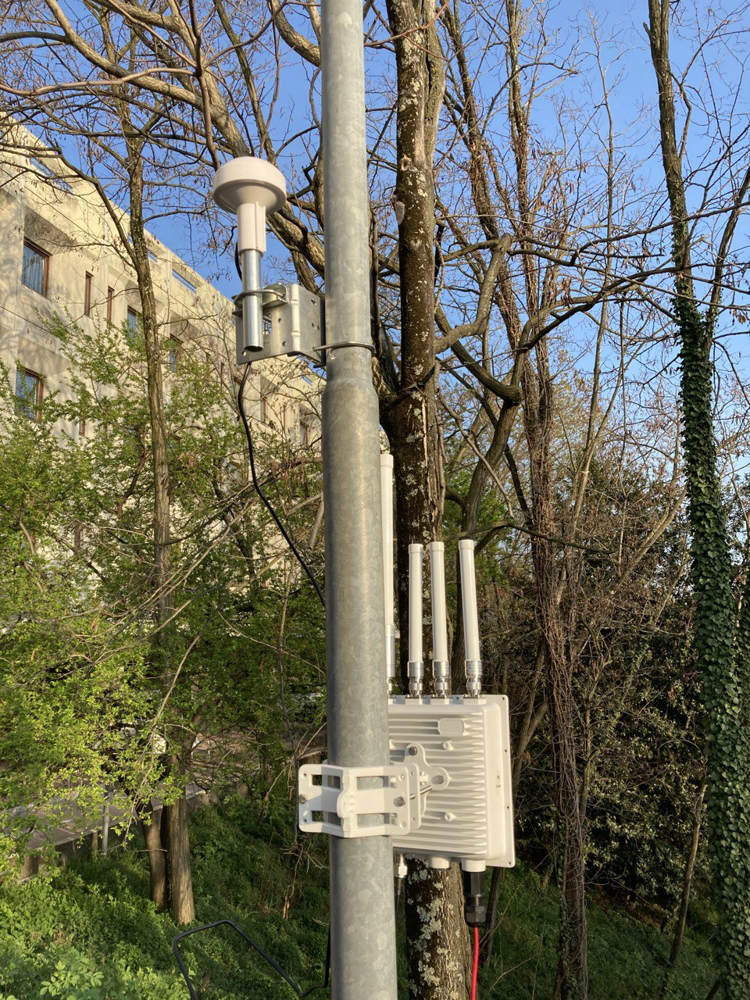

After attaching the antennas, you should connect the outdoors type
Ethernet cable between the female Ethernet connector protected with the
black plastic cable gland at the bottom of the gateway and the connector
labeled as POE in the POE injector.

**CAUTION**: Bear in mind that this port will inject 48 V to any device
connected to it. A device not meant to be supplied with PoE (like your
laptop) wil be damaged if connected.

The cable gland is a plastic receptacle that has a knotted hexagonal
convex nut that screws in a cylinder with threads at both ends; one of
the ends has many slots forming a skirt inside which there is a soft
rubber cylinder with an opening on the side, at the other end there is a
flat rubber gasket, on the side that connects to the plastic housing
attached to the gateway bottom.

Unscrew the black plastic convex hexagonal nut of the gland, remove the
slotted soft rubber cylinder.

Slide the Ethernet connector inside the convex nut, the soft rubber
cylinder and the barrel plastic connector, as shown in the following
picture:

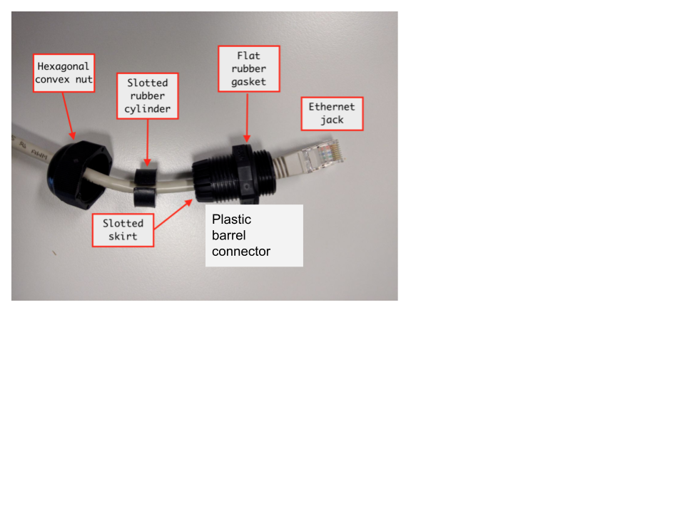

Insert the Ethernet jack (RJ45 male) connector into the female Ethernet
connector inside the Ethernet gland of the gateway, screw the barrel
connector to the connector attached to the gateway.

Insert the soft rubber cylinder inside the skirt of the barrel connector
until it is flat with the end of the skirt. Then screw the convex cap
that will hold the Ethernet cable tight by means of the rubber cylinder.

Note that if you ever need to remove the Ethernet jack you will need to
pry with a small screwdriver the small plastic retainer on the jack
before gently pulling the cable.

You can connect the GPS antenna to the Type N connector at the bottom.
The complete set up is as depicted here:

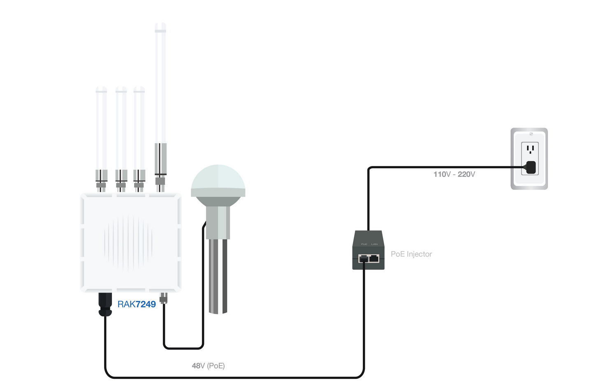

#### **Weather Protection**

To better protect the Ethernet cable gland and the type N antenna
connectors from the weather, you need to cover them first with the
supplied electrical insulating PVC tape. 

1\. Clean the surface area of the connector that will be wrapped. Wrap a layer of PVC tape with a 50%
overlap according to the rotation direction of the connector. Continue
wrapping the PVC tape to about 1 cm below the end of the connector. This
step is intended to prevent the waterproof tape that will be later
applied to stick to the connector, making it easier the maintenance
interventions.

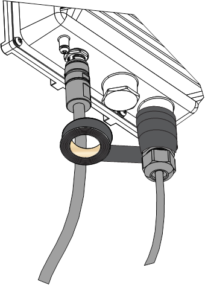

2\. Cut off about 50 cm of waterproof tape. This is made with a self
agglomerating material and will prevent the ingress of water. Stretch it
until its length doubles. Wrap three layers around the connector with a
50% overlap. Hold the tape in place with your hand for a few seconds.
The waterproof tape will become brittle when exposed to the sun, so it
is necessary to protect it with another layer of electrical tape.

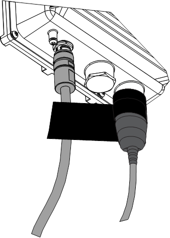

3\. Wrap three additional layers with PVC tape with a 50% overlap. Make
sure to cover the head and the tail of the connector.

Repeat the procedure with the type N connectors in areas of heavy
rainfall to prevent water creeping inside the gateway enclosure.

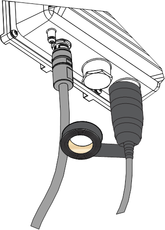
