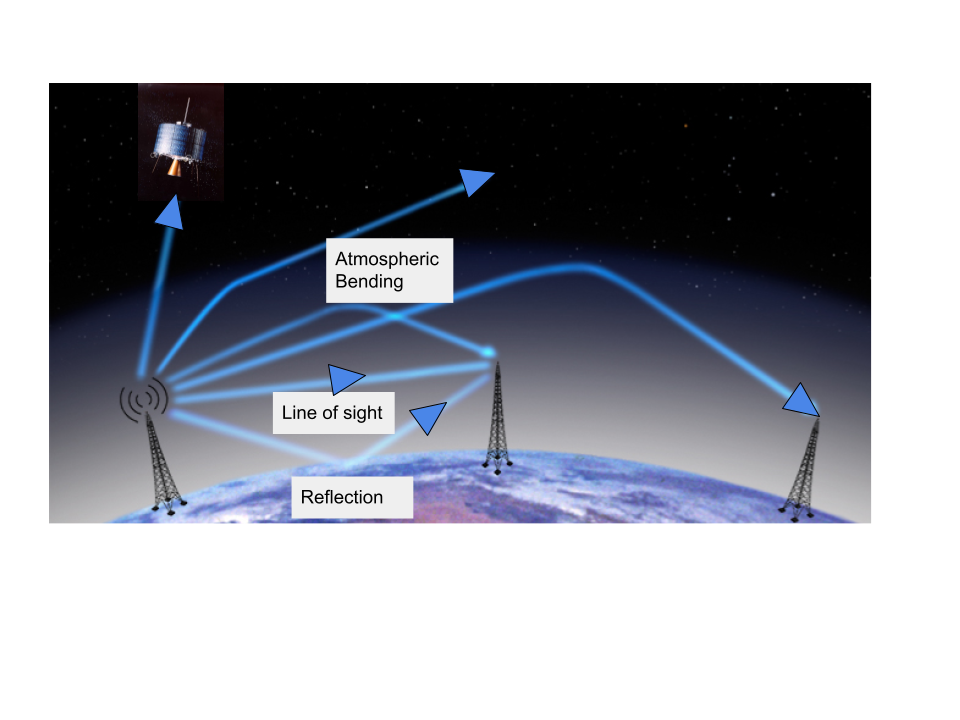
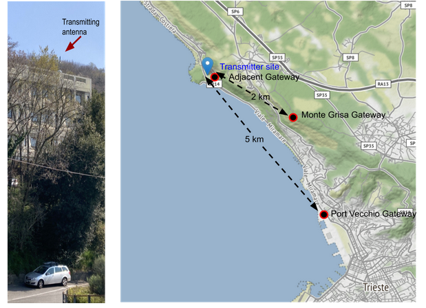

## Basics of radio propagation

Any kind of information can be transmitted using radio waves. The
transmitter produces a carrier wave at the specified frequency which is
modulated with the information. The transmitter is composed of
electronic circuitry, powered by electricity, and an antenna that
launches the wave. The wave is captured by the receiver\'s antenna and
demodulated to convey a replica of the original information.

For a successful demodulation, the received signal must be able to
overcome the always present noise and interference. The farthest the
receiver is from the transmitter, the weaker the received signal will
be. Furthermore, any obstacle between the transmitter and the receiver
will absorb part of the signal, so for optimum reception we strive for
an unobstructed line of sight (LoS) between the transmitter and the
receiver. This is normally achieved by installing both transmitting and
receiving antennas as high as practical and procuring a direct
visibility between them.

Nevertheless, in some circumstances the reception is possible even when
the line of sight is obstructed, by leveraging reflections which
establish indirect paths. Changes of direction of the wave (bending) can
also occur due inhomogeneities in the atmosphere. These effects are
strongly dependent on the frequency of the wave.

The amount of absorption or attenuation undergone by the signal while
traversing an object depends on the frequency, the type of obstacle and
the length of the object. Dry leaves will absorb very little, but wet
ones will heavily attenuate the signal.

As a real life example, consider a transmitter in a mast on the top of
the building shown in the picture, fitted with an omnidirectional
antenna that sends about the same amount of power in every direction:

The signal with a power of 13 dBm (20 mW) at the frequency of 868 MHz,
was received by four different stations at the same time.

Station 1 was on the same roof, very close to the transmitter, the
received power was 60 dB below the transmitted power (1 million times
weaker), because only a fraction of the transmitted power is captured by
the receiving antenna.

Station 2 was in the basement of the same building, which is made of
reinforced concrete, so there is a significant absorption by the walls
and floors, resulting in an attenuation of 116 dB.

Station 3 was 5 km away, in another roof, with an unobstructed view
(Clear Line of Sight). The attenuation was 123 dB.

Station 4 was 2 km away, but with the line of sight partially
obstructed, resulting in an attenuation of 128 dB.

You can see that distance is not the [only] factor that affects the
reception. Keep also in mind that when repeating the experiment at
another time, the measured values showed differences of a few dBs from
the previously reported.

For further details about radio propagation download the [Physics and Telecommunication Basics](http://wndw.net/pdf/wndw3-en/ch02-telecommunications-basics.pdf) files from [WIRELESS NETWORKING IN THE DEVELOPING WORLD](http://wndw.net/book.html)

Last edited 2021/04/13
