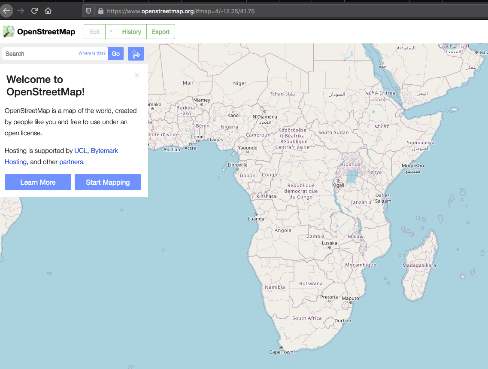

## Gateway and nodes site selection considerations

The site selection must consider several factors, some of which might be
conflicting, so a compromise must be reached.

For instance, for maximum coverage, the location of the Gateway should
be as high as possible, so choosing a mountain peak is desirable. But
often there might not be a road to that particular site. Although
electrical power can be provided by autonomous powering systems like
photovoltaic or eolic, there is always the requirement to protect the
equipment from theft and vandalism, so this might lead to choosing a
suboptimal location in terms of coverage, which nevertheless offers more
probability of sustainability.

The criteria for **Gateway** placement are therefore:

1)  Physical security for the equipment

2)  Internet connectivity: Fiber optics, Ethernet, Cellular, Long Distance WiFi or Satellite

3)  Robust radio path to the end nodes to be served (BotRf, a software that runs as a Telegram bot, can be leveraged to for this by simply inputting the coordinates of the Gateway and the end node)

4)  Accessibility of the site (conditions of the road, specially in the rainy season)

5)  Availability of electrical grid power

6)  Long term access to the site (Arrangement with the site\'s owner)

Many of these criteria pertain as well to the selection of the end node,
where the sensors will be located, except for points 2 and 5 since
connectivity will be provided through the LoRaWAN network while the
sensors are equipped with batteries and in some cases solar panels.

Google maps is a very useful tool that can be used in the planning
procedure. Its terrain feature shows the contour lines and it also
provides geographical coordinates, including elevation. Any GNSS (GPS,
Galileo, Glonass) receiver (often included in smart phones) can also
provide coordinates, although their elevation value has greater
uncertainty.

[OpenStreetMap](https://www.openstreetmap.org/) is a good alternative to
Google maps, which leverages inputs from users.

