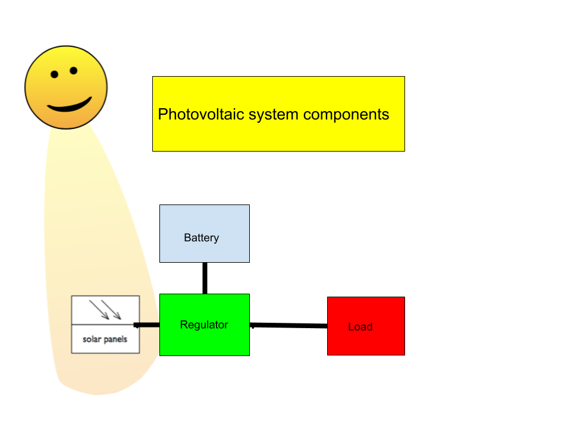
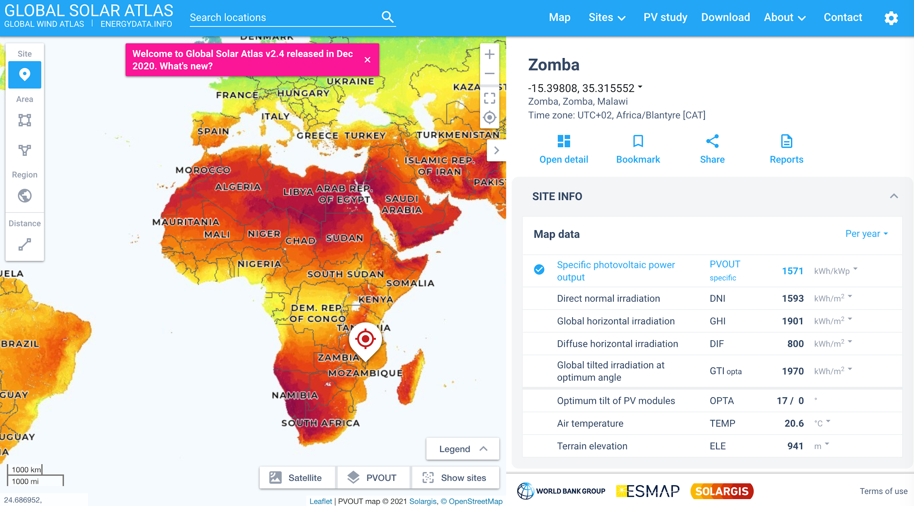

## Introduction

A simple photovoltaic system comprises three building blocks as shown in
the following figure:

The solar panel is composed of a number of solar cells that convert the
sunlight into electricity. The amount of electricity produced is
proportional to the amount of sunlight, so a battery is required to
store the electricity when there is no sunlight. The battery must be fed
with the proper voltage, avoiding overcharging or over discharging it,
so a Regulator is needed. The load, that is the device that uses the
electricity, must also be supplied with a fixed voltage, very often 12 V
DC.

Therefore the Regulator, which must take care of the proper charging of
the battery and of supplying the required voltage to the load, will have
three pairs of terminals, one connected to the solar panel, another
connected to the battery and the third pair connected to the load. The
interconnecting cables carry low voltage DC currents, so they must be
kept short to minimize losses.

The solar panel should be oriented towards the Equator, that is facing
North if we are in the southern hemisphere, and with an inclination
proportional to the latitude of the site.

It is very important to install the panel **out of reach of** any object
that can cast a shade in any portion of the panel, since this would not
only reduce the electricity output but could also damage the panel
itself.

A minimum inclination of 5 degrees is required at the Equator to
facilitate the washing of the panel by the rain.

The height over the terrain is irrelevant but a good ventilation is
important since the output of the panel decreases as the temperature
increases.

For optimum panel inclination and insolation details visit
[https://globalsolaratlas.info/map](https://globalsolaratlas.info/map)

In this example, we find that for Zomba, in Malawi, at a latitude of
15.39 degrees, the optimum inclination is 17 degrees, pointing North.

Details about photovoltaic system design can be obtained by downloading
chapter 14, \'Off grid powering\' of the \"Wireless Networking in the
Developing World\" book accessible at:
[http://www.wndw.net/book.html](http://www.wndw.net/book.html)

Automotive type batteries are not optimized for photovoltaic
applications. Nowadays the preferred batteries for both sensors and
gateways are based on Lithium.
