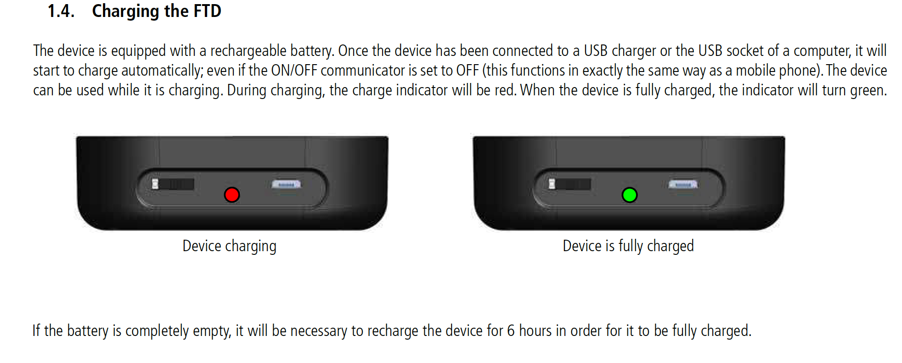
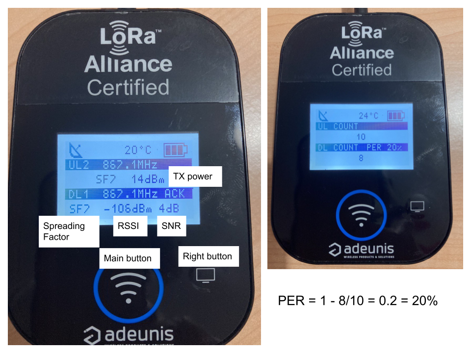
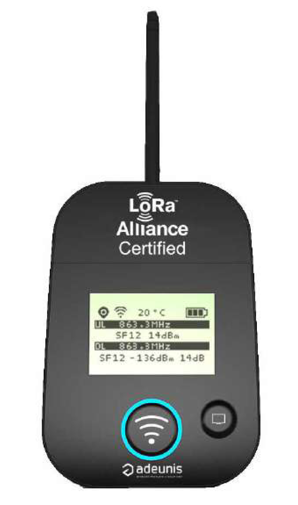

## Coverage testing with Adeunis

The Adeunis Field Test Device (FTD) can be used to measure the received
signal power at a specific place, as well as to perform packet error
reception rate test.

The built in GPS receiver shows the coordinates of the site

Viewable data: UL/DL - Channels - RSSI/SNR/

PER - GPS - Temperature

Turn ON the device using the sliding switch next to the LED. It will
show the temperature and device version for a few seconds, then it will
start sending uplinks packets. The screen will show the packet sequence,
the frequency in MHz, the spreading factor SF, the transmitted power (14
dBm, that is 25 mW). The gateway that received the strongest signal will
send a downlink packet, its sequence number and frequency will be shown
in the fourth row, and then in the fifth row the downlink SF, the RSSI
(Received Signal Strength Indicator) in dBm and the Signal to noise
ratio (SNR) in dB.

The received signal power in dBm will always be a negative number, since
it is much lower than 1 mW. The signal to noise power in dB can be
positive or negative, the greater this value the better the chance of
correctly detecting the signal.

Pushing the main button will send another uplink packet (UL) packet that
if received will cause a corresponding downlink (DL) packet.

Pushing the right button reveals the GPS screen, showing the number of
satellites received and the latitude and longitude of the site.

Pushing again the right button enables the transmission of a sequence of
UL packets that will trigger DL packets from the gateway.

The screen will show the Up Link count, the Down Link count
(corresponding to packets successfully received) and the Packet Error
Rate (PER) in percentage.

The PER Packet Error Rate is calculated comparing the number of frames
transmitted to the number of frames received, that is DL packets
received /UL packets received

PER = 1 - DL_COUNT / UL_COUNT

PER (%) = 100 - (( DL_COUNT / UL_COUNT) \* 100)

The lower the PER, the stronger the link, which is usually associated
with a greater value of SNR, however sometimes a strong signal might not
be properly detected because of noise or interference, so the PER is a
better parameter to assess the suitability of a given site for LoRaWAN
communications.

[Here](https://www.adeunis.com/wp-content/uploads/2020/03/User_Guide_FTD_LoRaWAN_EU863-870_V2.0.0.pdf) you can download the ADEUNIS FTD manual in French and in
English

dBm = 10\*log~10~ (P/1mW) dB = 10\*log~10~ (P2/P1)

And [here](https://www.internetsociety.org/wp-content/uploads/2017/10/dB-Math.pdf) a presentation about dB and dBm

