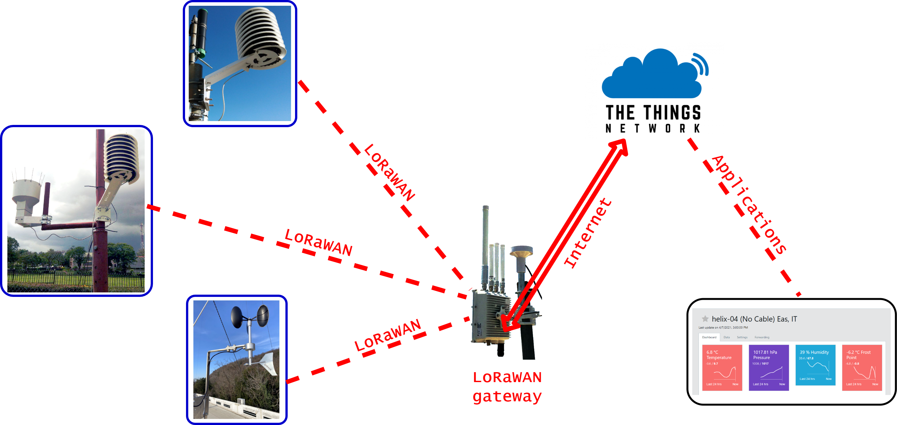

# The Things Network (TTN)

[https://www.thethingsnetwork.org/](https://www.thethingsnetwork.org) is a global open LoRaWAN network that allows the use of the required network and application servers at no cost for the user.

Publicly available LoRaWAN gateways have been installed in many places as part of TTN, and they can be used for free, while the traffic of each user is protected by its own application key. In this case the only cost involved is that of the end node transceiver, with no recurring costs. Of course, the traffic is limited, but well within the requirements of many sensor applications.

Alternatively, If no TTN gateway is available in the area of interest, one can resort to install a LoRaWAN gateway, which must be provided with Internet connectivity (by cabled Ethernet, WiFi or Cellular) and powered by the electrical grid or a photovoltaic system. A number of LoRaWAN gateways are commercially available with prices starting at about 200 Euro. In this case the Network and Application servers provided by TTN can still be leveraged, since they are reachable through the Internet from any Internet connected gateway.

In this example we have a basic meteorological station, another equipped also with a rain gauge, and an independent wind speed and direction sensor, each equipped with a LoRaWAN transceiver that conveys the gathered data to the Internet connected LoRaWAN gateway.

TTN takes care of monitoring devices, decrypting packets, routing data to processing services, and sending packets back to devices. Packets are encrypted by endpoint devices by means of device key and by application key, so payload data is accessible only to the owner, by means of an Internet browser.

Adding another LoRaWAN sensor involves simply writing a new application that will be transparently processed by TTN.

LoRaWAN uses unlicensed frequencies, which are subject to interference from other users, and restricted in the amount of time that each device can occupy a channel, but these limitations do not impede the delivery of most services, as witnessed by the widely deployed WiFi networks, which also use unlicensed frequencies

Cellular operators have exclusive access to the frequencies they use, for which they have paid hefty sums, and are protected from interference from other users.
